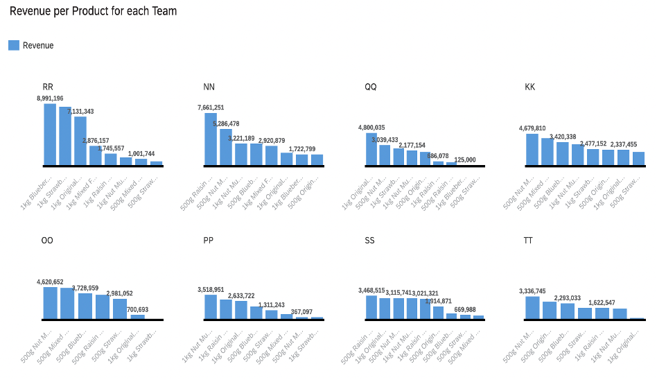

# SAP Analytics Cloud 
SAP Analytics Cloud is used to create visualizations and derive meaningful information by analyzing ERPSIM data. 

## About SAP Analytics Cloud
It is a tool which has provided a platform to the users where they get all the capabilities of creating data visualizations in the cloud at one point, in combination to Business Intelligence, augmented and predictive analytics, and governance, risk, and compliance (Createch, 2020). I chose this tool to include in my portfolio because of the flexibility it provides in terms of creating informative and appealing visualizations along with the fact that it is a very easy to work with kind of tool. It is accessible online in SaaS mode and allows the data analysts to have data sources and the analytical/ reporting functions at one secure, cloud-based environment without switching to different tools. Following are the key capabilities of this tool (Createch, 2020):

 - Explore and derive meaningful insights by highlighting the data across the organization using various types of graphs, creating interactive dashboards. 
 - The SAP Cloud allows the user to obtain the data by importing it from a local file, OData Service, or directly accessing the ERP where the updated real-time data can be obtained.
 - This tool provides easy ways to do modifications in the data according to the requirement of user such as creating new fields, modifying data types, or modifying the existing fields.
 - It has incorporated the Artificial Intelligence innovations to perform predictive analytics and allows to create dashboards via smart discovery, detection of off-trend records, etc. 
 - It enables the users to make decisions by using machine-generated or augmented analytics capabilities, which also helps the users in planning both the financial and operational statements.
 - Provides the intuitive self-service analytics with Business Intelligence features.

## Dataset and Research questions
SAP Analytics Cloud will be used to create visualizations and derive meaningful information by analyzing ERPSIM data. This data is a result of a simulation game played previously by different teams over several rounds who sell up to 12 products in the market in 3 different distribution channels (Hypermarkets Grocery Chains, and Convenience Stores), in the area North, South and West on different days. The dataset is imported by clicking on the File icon, and then choosing the excel file from the local storage. In the data modelling interface, various modifications can be done to the dataset imported. Also, SAP Analytics Cloud has all the fields sorted as either measure or dimension. Measure is a field on which calculations can be made and dimension is the reference information about the measure. In this dataset, all the fields are dimensions except Price, Quantity, and Revenue.
Following are the questions that will be answered:

 - What is the revenue generated from each product by Top 8 teams?
 - What are the trends of revenue generated over the rounds for each team?
 - What is the market share of each team for all the products?
 - What is the revenue per distribution channel for each product? Are there any products that are not popular in certain distribution channels?
 - What is the quantity of each product sold by different teams on all days of Round 1? Do all the teams contribute to the quantities sold of all the products equally?
 - What is the overall relation between revenue generated and quantity of product sold for all the Teams, Products, and Rounds?

## Applying the Analytical Tool and Results

##### Question 1: What is the revenue generated from each product by Top 8 teams?
The following figure shows a column chart where the measure is Revenue, and the dimension is Product. To represent the information in a well-organized manner for each team, the trellis is chosen as Team. The highest revenue generated is 8,991,196 by Team RR by selling 1kg Blueberry Muesli followed by 1kg Strawberry Muesli. Also, the top 3 teams in terms of highest revenue generated are: RR, NN, and QQ while TT is the last team in the list. Also, it is very easy to identify the products which generated most and least revenue for every team from the following chart. 

##### Question 2: What are the trends of revenue generated over the rounds for each team?
The following figure shows a line chart where y-axis represents Revenue and x-axis represents the Rounds along with color and trellis chosen as Team. The highest revenue is generated by team RR which shows a mostly upward trend. Team OO shows a downward trend after round 3 whereas team KK shows a relatively constant trend after round 3. For most of the teams, the trends are rather uneven showing a non-continuous increase and decline in revenues for each round.

##### Question 3: What is the market share of each team for all the products?
Figure shows a stacked column chart where the measure is Revenue, dimension is Product, and the color is chosen as team to easily identify the market share of each team for the respective products. This graph helps us identify the product which has generated the major and the least revenue i.e., 500g Nut Muesli and Mixed Fruit Muesli respectively and team NN has the highest market share for both these products. Also, through this graph it is easily identifiable that the team NN has the most market share of the product 500g Nut Muesli, while PP has the least. Also, team RR has the most market share of 1kg Blueberry Muesli which was also visible in Figure 15, as their highest revenue was generated by this product. Also, interestingly only 1kg Nut Muesli product has been sold by 9 out of 10 teams.

##### Question 4: What is the revenue per distribution channel for each product? Are there any products that are not popular in certain distribution channels?
Figure shows a heat map where x-axis represents Distribution Channels, y-axis represents Product and the variation in color shows the Revenue. It is interesting to note that only Grocery Chains is selling all 12 kinds of products while both the other distribution channels are dealing in 6 types of products which are not cross competing with each other. Also, the highest revenue generated by 500g Nut Muesli is in Convenience Stores followed by 500g Raisin Muesli. In case of Grocery Chains 1kg Nut Muesli is leading while in Hypermarkets 1kg Original Muesli has captured the market. It is an interesting graph to identify the products sold and their revenue generated in each kind of distribution channel.

##### Question 5: What is the quantity of each product sold by different teams on all days of Round 1? Do all the teams contribute to the quantities sold of all the products equally?
Following Figure represents a column chart where measure is Quantity and dimensions are Round, Day and Team. Different colors represent different products, and a filter is applied on the dimension Round to only include Round 1. The following graph gives tremendous insights on the data used. On day 8 of round 1, only 21,000 quantities of 1kg Nut Muesli were sold by team PP. Also, on day 9 only 4 out of 10 teams sold any products and none of them sold the same products. On day 10 only team PP sold 2 out of 12 products, while other 4 teams sold 1 kind of product each. Also, not even on a single day of Round 1, all the teams work at the same time. The graph clarifies that a team does not necessarily generate their revenue on a daily basis by selling some quantities of all the products, rather they focus on either 1 or just a couple of products on a single day. 

##### Question 6: What is the overall relation between revenue generated and quantity of products sold for all the Teams, Products, and Rounds?
Figure represents a dashboard created using the smart discovery feature provided by SAP Analytics Cloud, where the measure selected is Revenue and the dimensions are Team, Product, and Round. The graph generated is a scatterplot where x-axis represents Revenue and y-axis represents Quantity. The revenue and the quantity displayed are resulted by the combination of all the dimensions in total. Overall, the graph tells us that total revenue generated is less when less quantity is sold while more revenue is generated when high quantity of product is sold, therefore correlation is observed with positive association and moderate relationship between both the measures. 

## Analysis and Critique of the Tool
SAP Analytics Cloud is a user-friendly tool which is very easy to learn to visualise and analyse the data by creating interactive dashboards, perform predictive analytics and utilise the artificial intelligence to derive information about off-trend records. It is a great tool which has incorporated many functionalities to make it a go-to tool for data analysts and decision makers in an organization. 

There are many strengths of this tool which makes it a strong competitor among all the data visualisation software available in the market. One of the many strengths of this tool is that it provides the flexibility to the users for importing the dataset, as it can be done by the local files or directly from the databases. Also, the smart discovery functionality and business intelligence features of this tool makes it very easy for the users to discover the unknown trends in the dataset and derive useful and actionable insights from the data. It provides a secure and cloud-based environment to store all the data insights and visualisations which is a great feature. 

Few limitations of this tool are that it is very heavily embedded in the SAP environment, making it harder for third-party integrations or connection. This tool offers a 30-day free trial which is enough time to learn and play around with this tool for creating amazing visuals, but if one needs a solution for their long-term projects or creating visualizations, then I believe that there are already other tools which are free and offers an amazing user-interface to create interactive dashboards.

## Conclusion:
This is a great tool for data analysts, and it makes the process of data visualization fun and easy. It is a comprehensive solution for creating complex charts and dashboards via merging Artificial Intelligence to discover the insights of data, that might have been missed otherwise. Overall, it is a great tool to include in your professional portfolio and impress the people by flaunting your visualization skills of showing the information in a fun and easily understandable manner. 
